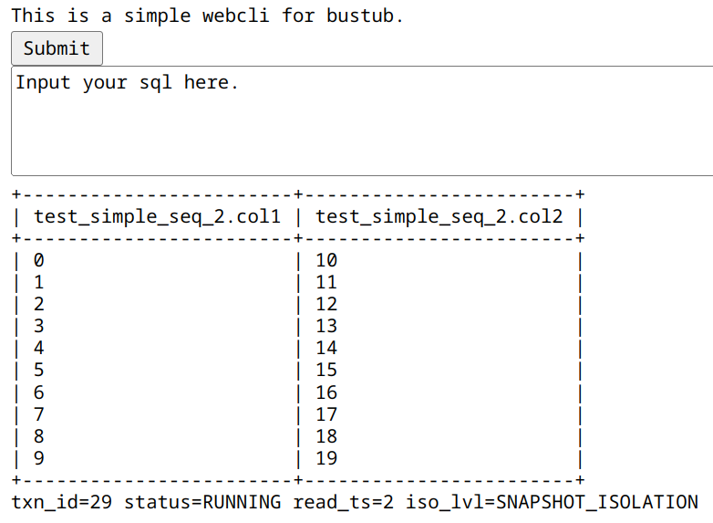

# A web shell for bustub

Yeah, to the [bustub-web-shell](https://github.com/skyzh/bustub-web-shell), I have to install vercle.

But, it has some brand-new language candy, like:

```javascipt
if (typeof this._dest?.[method] === "function") {
(theme) => theme?.style)
store.hooksCleanup[index]?.();
```

So I cannot run it in my ubuntu server 20.04 successfully in a short time(I want to achieve this in a morning). So I made this simple web shell.



All you have to do:

1. git clone this project

2. Install django

3. run bustub-nc-shell

```shell
# For serializable mode, change port in webustub/views.py to 23334, then call:
bustub-nc-shell --serializable --port 23334
```

```shell
# For snapshot mode, change port in webustub/views.py to 23333, then call:
bustub-nc-shell --port 23333
```

WARN: Multi-user in the same time is not support yet. To achieve this, you'd better using nc directly.

WARN: Time spending SQL will block this webshell.

BUG: A pretty long SQL may cause wrong format, cuz the TCP feature.

# 一个简单的bustub web shell

要使用官方的bustub-web-shell，就需要安装vercle，但是它用上了一些新的语法糖，比如：

```javascipt
if (typeof this._dest?.[method] === "function") {
(theme) => theme?.style)
store.hooksCleanup[index]?.();
```

短时间内我没法在我的ubuntu 20.04服务器上跑起来，但是我希望在一个早上的时间部署完，所以我做了这个webshell。


要使用这个仓库，你需要这么做：

1. git clone 这个仓库

2. 安装django

3. 执行bustub-nc-shell

```shell
# 使用串行化模式，设置webustub/views.py中的port为23334，然后执行：
bustub-nc-shell --serializable --port 23334
```

```shell
# 使用串行化模式，设置webustub/views.py中的port为23333，然后执行：
bustub-nc-shell --port 23333
```

警告：暂不支持多用户同时使用。为了能够多用户使用，你需要直接使用nc

WARN: 耗时很长sql会阻塞这个shell。

BUG: 由于TCP的特性，字符串长度比较长的SQL可能会导致输出错误
